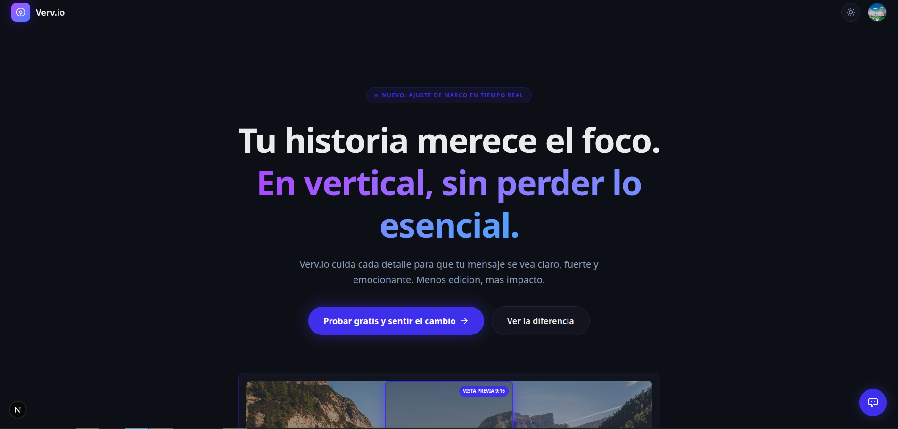

# Verv.io - Video 16:9 → 9:16 (Smart AI Crop)

Verv.io es una plataforma SaaS avanzada para convertir videos horizontales (16:9) a formato vertical (9:16) optimizado para TikTok, Reels y Shorts, utilizando inteligencia artificial para el reencuadre dinámico y la detección de momentos virales.



## 🚀 Estado actual del producto (MVP+)

- **Editor Web Profesional**: Interfaz para cargar videos, ajustar el área de interés, recortar clips y previsualizar en tiempo real.
- **Detección de Momentos Virales**: Integración con **Gemini AI** para analizar transcripciones y encontrar los segmentos más impactantes.
- **Smart Dynamic Tracking**: Sistema híbrido (MediaPipe + OpenCV) que mantiene a los sujetos centrados automáticamente durante todo el clip.
- **Subtítulos Inteligentes**: Transcripción automática con **Whisper AI** y quemado de subtítulos estilizados en el video final.
- **Branding y Personalización**: Soporte para overlays de logos, texto personalizado (CTA) y marcas de agua dinámicas.
- **Pipeline de Alto Rendimiento**: Procesamiento asíncrono con **Celery**, streaming de uploads (bajo consumo de memoria) y optimización FFmpeg para móviles.
- **Autenticación y Seguridad**: Google OAuth, gestión de sesiones JWT, rate limiting y protección CSP/CORS.

## 🏗️ Estructura del repositorio

```text
video-mvp/
├── frontend/    # Next.js 16 + React 19 + Tailwind v4 + Zustand
├── backend/     # FastAPI + MongoDB + Redis + Celery + FFmpeg + IA
├── data-app/    # Scripts y utilidades de análisis de datos
└── skills/      # Recursos auxiliares para agentes
```

## 🛠️ Stack Tecnológica

### Backend (Core)

- **Framework**: FastAPI (Python 3.12+)
- **Base de Datos**: MongoDB (Motor async driver)
- **Caché**: Redis (Redis-py async)
- **Procesamiento de Video**: FFmpeg & FFprobe
- **IA & Computer Vision**:
  - **MediaPipe & OpenCV**: Tracking dinámico y reencuadre inteligente.
  - **OpenAI Whisper**: Transcripción de audio a texto.
  - **Google Gemini**: Análisis de contenido y detección de clips virales.

### Frontend

- **Framework**: Next.js 16 (App Router)
- **Librería UI**: React 19 + TypeScript
- **Estilos**: Tailwind CSS v4
- **Estado**: Zustand
- **Iconos**: Lucide React

### Infraestructura

- **Tareas Asíncronas**: Celery + Redis
- **Almacenamiento**: Cloudflare R2 / S3 (Storage Service agnóstico)
- **Gestión de Paquetes**: `uv` (Python) y `npm` (JS)

## 🚦 Máquinas de Estado Implementadas

El sistema se rige por flujos de estados estrictos para garantizar la integridad de los datos:

### 1. Procesamiento de Video

`UPLOADED` → `PROCESSING` → (`PROCESSED` | `FAILED`)

- **UPLOADED**: Video recibido y validado en storage temporal.
- **PROCESSING**: Pipeline activo (Transcripción -> IA Viral -> Tracking -> Encoding).
- **PROCESSED**: Video final listo para descarga y optimizado.
- **FAILED**: Error en el pipeline con logs de recuperación.

### 2. Verificación de Usuarios

`PENDING` → (`VERIFIED` | `REJECTED`)

- Control de acceso al panel admin y límites de procesamiento.

### 3. Motor de Tracking Híbrido (Interno)

`PENDING` → `INIT` → `TRACKING` → `LOST & SEARCHING`

- Garantiza que el reencuadre 9:16 se mantenga suave y centrado incluso si el sujeto se mueve bruscamente.

## 🛠️ Inicio rápido

### 1) Backend

```bash
cd video-mvp/backend
cp .env.example .env
uv sync
uv run uvicorn app.main:app --host 0.0.0.0 --port 8000 --reload
```

### 2) Frontend

```bash
cd video-mvp/frontend
npm install
cp .env.example .env.local
npm run dev
```

## 📚 Documentación Detallada

- [Análisis y Plan de Implementación](analisis.md)
- [Referencia de API Endpoints](video-mvp/backend/docs/API_ENDPOINTS_REFERENCE.md)
- [Documentación del Frontend](video-mvp/frontend/README.md)
- [Documentación del Backend](video-mvp/backend/README.md)

---

Proyecto Verv.io - Transformando contenido horizontal en experiencias verticales virales.
